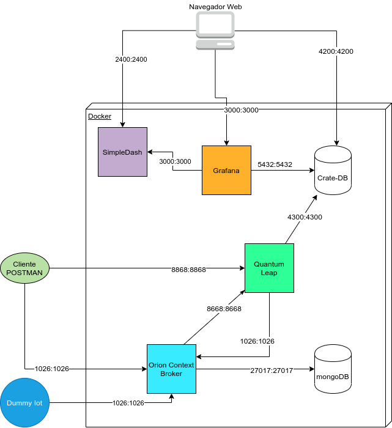
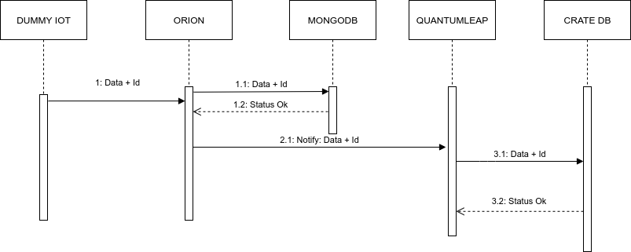

# intro-fiware-esc

# Tutorial

## Arquitectura



## Diagrama de Secuencia



## Listado de Componentes

| Servicio      | Puertos            |
| --------------|--------------------|
| SIMPLE-DASH   |  2400              |
| ORION         |  1026              |
| QUANTUMLEAP   |  8668              |
| GRAFANA       |  3000              |
| MONGODB       |  27017             |  
| CRATEDB       |  5432, 4300, 4200  |

## Recursos 

### http://localhost

| URL           | Descripción                                                          |
|---------------|----------------------------------------------------------------------|
| /             |   Dashboard generado en grafana                                      |
| /orion        |   Servicio de Orion Brocker, para la gestión de contextos            |
| /grafana      |   Grafana para creación de gráficos para visualizar datos            |
| /quantumleap  |   Servicio para percistencia de datos en cratedb                     |
| /cratedb      |   Base de datos para series de tiempo                                |


# LOCALHOST
## 1. Desplegar servicios definidos en docker-compose.yml

```
docker-compose up -d
```
## 2. Registro de entidad en Orion Context Brocker.
```
POST http://localhost/orion/v2/entities
Header: Content-Type: "application/json"
        fiware-service: openiot
        fiware-servicepath: /

En el body, utilizadmos el contenido de dht22.json
 

```
## 3. Subscripción de cambio de estado de entidad.
### Se crea un subcripcion de la entidad, esto quiere decir que cuando se actualice cualquiera de los datos de la entidad estos seran notificados al servicio de Quantumleap.
### Quantumleap, recive la notificacion del cambio de estado de los datos con el valor de los datos y los perciste en la base de datos CRATE DB.
### Quantumleap cuenta con una api y su documentacion se encuentra en el siguiente link : http://localhost:8668/v2/ui/

```
POST http://localhost/orion/v2/subscriptions/
Header: Content-Type: "application/json"
        fiware-service: openiot
        fiware-servicepath: /

En body, utilizamos el contenido de dht22-sub.json

```


##  Configurar Servicios:
### CRATE DB:

```
    localhost:4200
    -> (Observar el nombre de la base de datos generada automáticamente)
    mtopeniot

```

### Consulta por entidad registrada en base de datos.

```
select * from mtopeniot.etdht22 limit 100;
```
### Grafana:
### Grafana se configurar para ir obteniendo los datos que son percistido en la base de datos CRATE DB.
### En Grafana se pueden crear tableros par visualizar distintos tipos de datos e incluso grandes volumenes de datos.

### El nombre de la Database: mtopeniot es definido por el Header del registro en Orion Context Broker `fiware-service: openiot`.

```
    localhost:3000

    -> Postgres:
    Name: CrateDB
    Host: crate-db:5432
    Database: mtopeniot
    User: crate
    SSL Mode disable
```
```
New Dashboard

->
FROM etdht22 Time column time_index Metric column entity_id SELECT Column: temperature Column: relativehumidity 
```


## Problemas con CrateDB

#### Error 
```
ERROR: [1] bootstrap checks failed
[1]: max virtual memory areas vm.max_map_count [65530] is too low, increase to at least [262144] 
```
#### Solución en Linux

```
sudo sysctl -w vm.max_map_count=262144
```

Para que los cambios persistan en el sistema debemos modificar el archivo `/etc/sysctl.conf` y agregar la siguiente linea al final del archivo:

```
vm.max_map_count=262144
```


# Referencias:


#### https://documenter.getpostman.com/view/513743/RWEcR2DC?version=latest#eb4be0c3-5563-444a-9539-c90ef2df0fda

#### https://github.com/FIWARE/catalogue/blob/master/security/README.md

#### https://fiware-training.readthedocs.io/es_MX/latest/casodeestudio/descripcion/

#### https://hub.docker.com/r/fiware/quantum-leap/dockerfile

#### https://camo.githubusercontent.com/93f44facc15bb6a9edf6ab9968fc1d8b862033fe/68747470733a2f2f6669776172652e6769746875622e696f2f7475746f7269616c732e496f542d4167656e742f696d672f6172636869746563747572652e706e67

#### https://www.fiware.org/wp-content/uploads/2016/12/2_FIWARE-NGSI-Managing-Context-Information-at-large-scale.pdf

#### https://fiware-tutorials.readthedocs.io/en/latest/time-series-data/index.html
